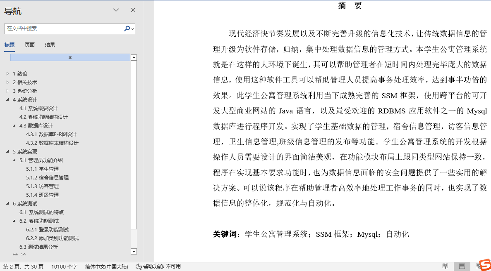
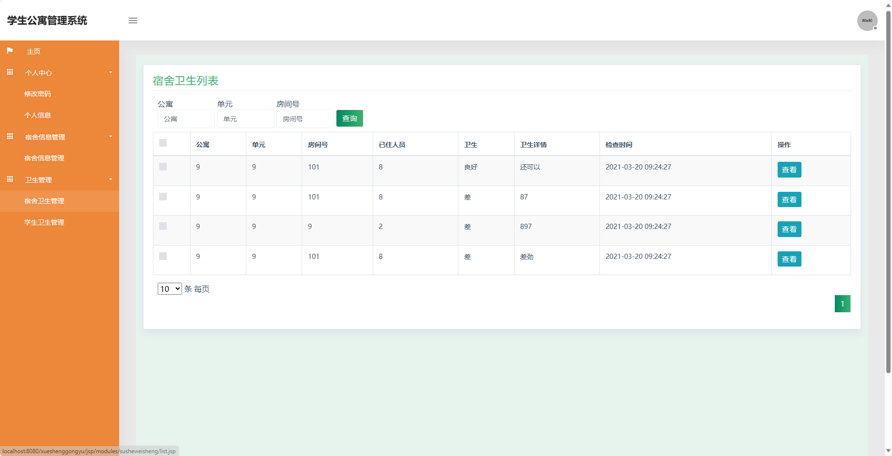
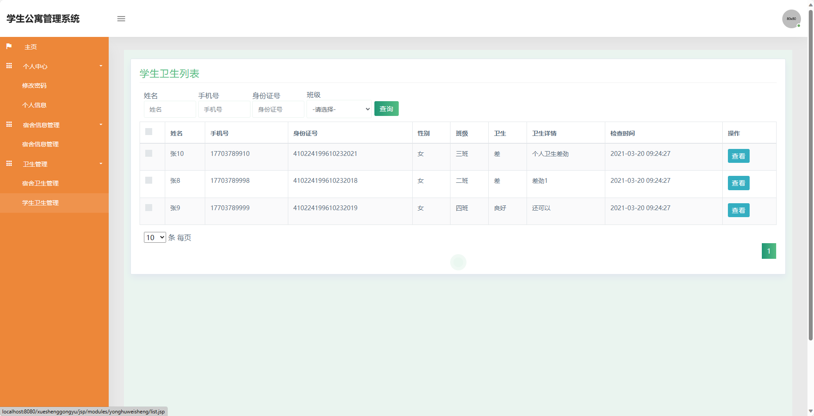
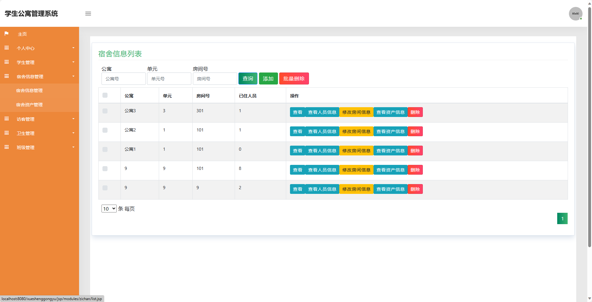
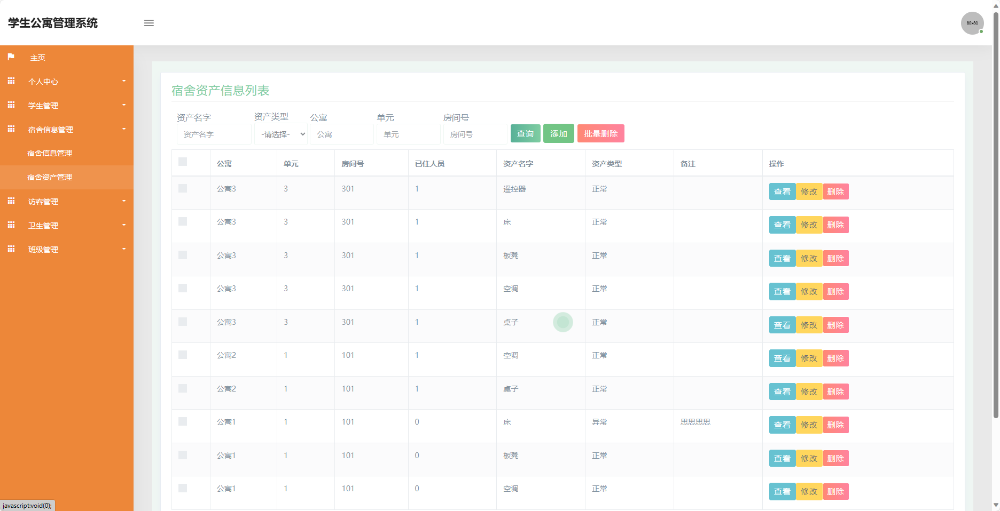
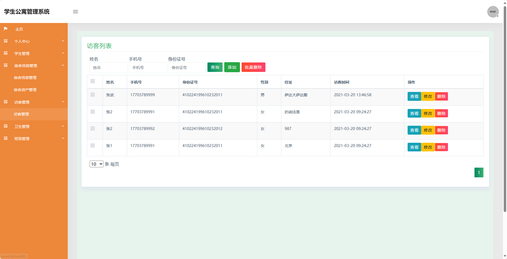
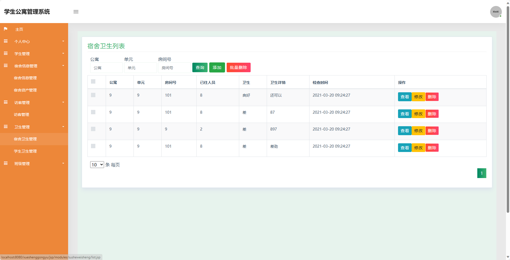
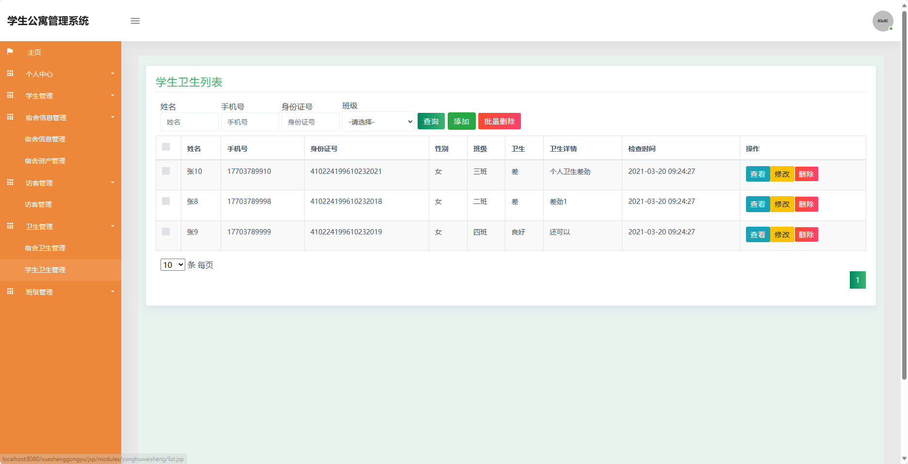
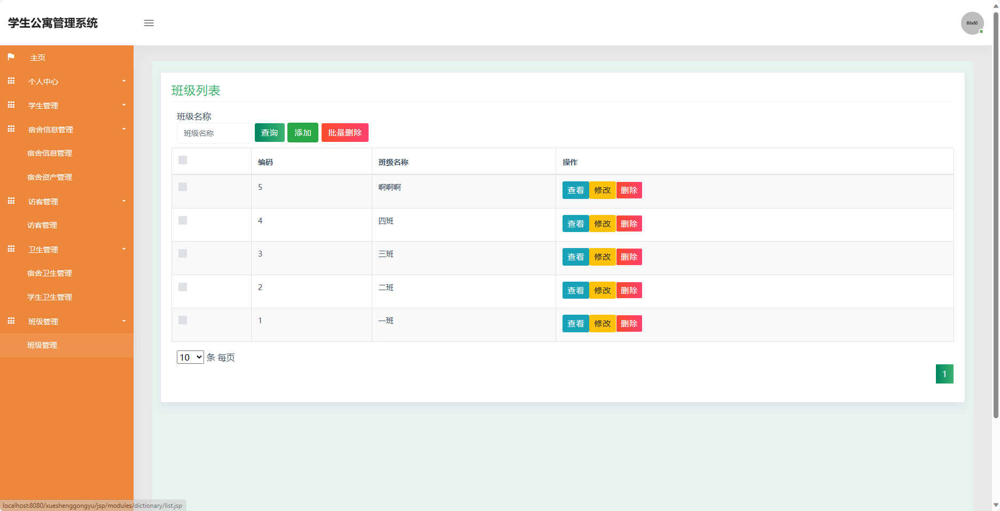
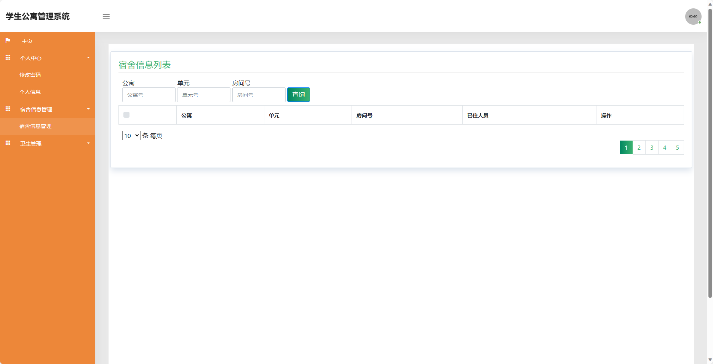

## 基于SSM的学生公寓管理系统(程序+报告)

- <b>完整代码获取地址：从戎源码网 ([https://armycodes.com/](https://armycodes.com/))</b>
- <b>技术探讨、资料分享，请加QQ群：692619798</b> 
- <b>作者微信：19941326836  QQ：952045282</b> 
- <b>承接计算机毕业设计、Java毕业设计、Python毕业设计、深度学习、机器学习</b>
- <b>选题+开题报告+任务书+程序定制+安装调试+论文+答辩ppt 一条龙服务</b>
- <b>所有选题地址 ([https://github.com/YuLin-Coder/AllProjectCatalog](https://github.com/YuLin-Coder/AllProjectCatalog)) </b>

## 项目介绍
基于SSM的学生公寓管理系统，系统包含两种角色：管理员、用户,系统分为前台和后台两大模块，主要功能如下。
前台-【用户】：
1. 个人中心：用户可以查看和管理个人信息，包括姓名、学号、联系方式等，还可以修改密码和联系方式。
2. 宿舍信息管理：用户可以查看宿舍的基本信息，包括宿舍号、楼栋号、床位数量等，还可以查询宿舍的入住情况和申请换宿舍。
3. 卫生管理：用户可以提交宿舍内的卫生情况，包括卫生得分、卫生问题反馈等，还可以查看宿舍卫生评分和历史反馈。
4. 宿舍卫生管理：用户可以查看宿舍内的卫生情况，包括宿舍得分、卫生问题等，还可以上传宿舍的卫生照片和评价。
5. 学生卫生管理：用户可以查看个人的卫生情况，包括个人得分、个人卫生问题等，还可以上传个人的卫生照片和评价。

后台-【管理员】：
1. 个人中心：管理员可以查看和管理个人信息，包括用户名、手机号码、员工编号等，还可以修改密码和联系方式。
2. 学生管理：管理员可以管理学生信息，包括添加、编辑和删除学生账号，查看学生基本信息和联系方式，控制学生的权限和角色。
3. 宿舍信息管理：管理员可以管理宿舍的基本信息，包括添加、编辑和删除宿舍，设置宿舍的楼栋号、床位数量等。
4. 访客管理：管理员可以管理学生宿舍的访客信息，包括添加、编辑和删除访客记录，查看访客进出宿舍的时间和目的。
5. 卫生管理：管理员可以管理宿舍的卫生情况，包括查看宿舍的卫生得分、问题反馈，还可以评定宿舍的卫生标准和分数。
6. 班级管理：管理员可以管理班级信息，包括添加、编辑和删除班级，查看班级内的学生列表，还可以设置班级的班主任和助教。

## 项目技术
- 编程语言：Java
- 数据库：MySQL
- 前端技术：JSP、JavaScript、jquery
- 后端技术：Spring、SpringMVC、MyBatis

## 运行环境
- JDK版本：JDK1.8及以上
- 开发工具：IDEA、Ecplise、Myecplise都可以
- 数据库: MySQL5.7及以上

## 运行截图

